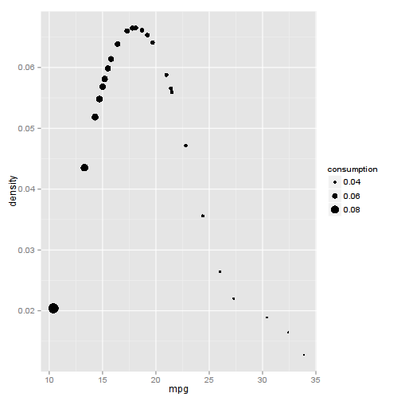

## The Problem: unreliable data from industry
Industry rigging of measurements: 

1.  Using special lubricants
2.  Using special tyres
3.  Nearly empty fuel tank and skinny drivers
4.  Empty roads allowing for continuous speed
5.  Down hill and rear wind
6.  Gasoline additives
7.  Exceptional chiptuning

--- .class #id 

## The solution
Buid a database updated by registered users

1.  Real use fuel consumption.
2.  Captures also the variance in consumption.
3.  Provides a predictive model to which the user can compare.
4.  Visual feedback how car is ranked.
4.  Attempts to influence the data is countered by anomaly detection.
5.  International database with a choice of units.

--- .class #id 

## Technology used

- A first data set i created from the mtcars data set:
- Redundant features dropped:

        - carb : nowadays mostly fuel injection
        - vs : more for damping vibrations. Other types possible(e.g. boxer) 
        - drat,hp,qsec: highly correlated with other features.
- fast model generation with linear regression, updated after each car addition
- density plot recallibrated.

```r
select<-c(TRUE,TRUE,TRUE,FALSE,FALSE,TRUE,FALSE,FALSE,TRUE,TRUE,FALSE)
mycars<-mtcars[,select]    # selecting initiation db
kernel<-"gaussian";points<-1;dof<-32  # user adjustable density plot smoothness
dens <- density(mycars$mpg, bw = "SJ", kernel = kernel, points)
spl <- smooth.spline(dens$x, dens$y, df=dof, keep.data=FALSE)
```

--- .class #id


```r
library(ggplot2)
c <- predict(spl, mycars$mpg);data<-data.frame(mpg=c$x,density=c$y,consumption=1/c$x)
ggplot(data,aes(mpg,density)) +geom_point(aes(size=consumption))
```

 

--- .class #id

## Conclusion and future developments

-  Lean system easy to deploy
-  Need to implement locked interface
-  Only members can add cars 
-  Implement anomaly detection
-  Add additional features , year, turbo, hybride ,....

### **THANK YOU!**
